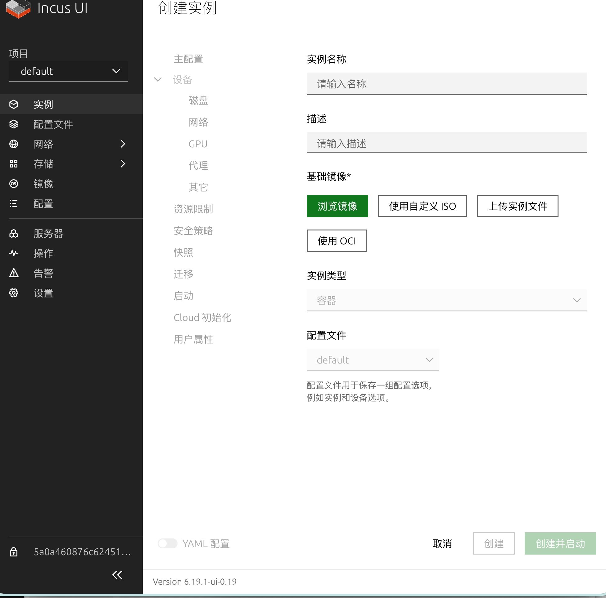
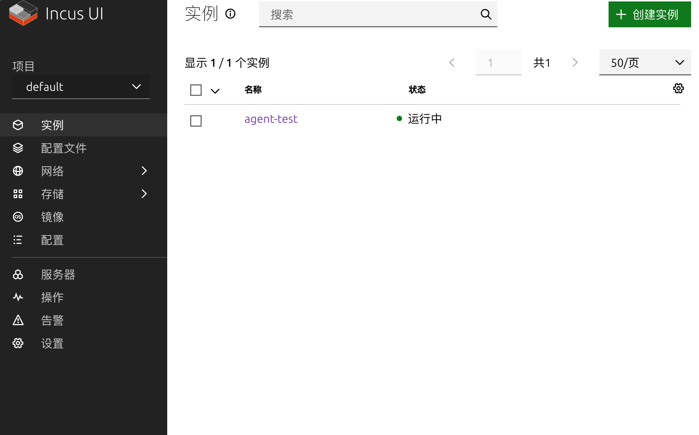
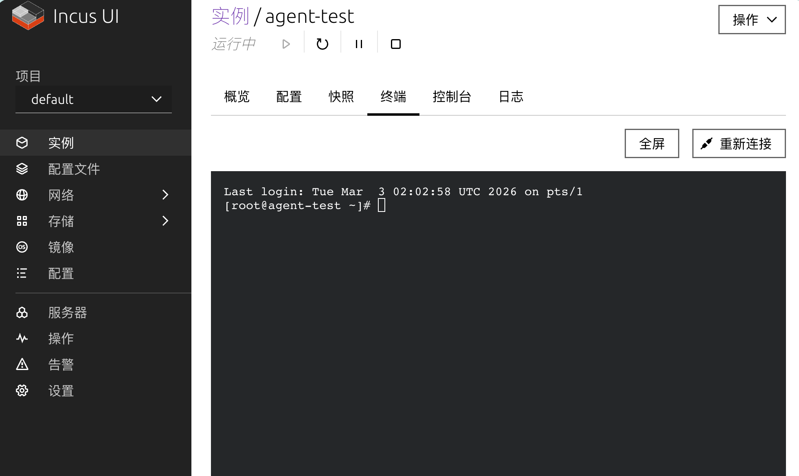
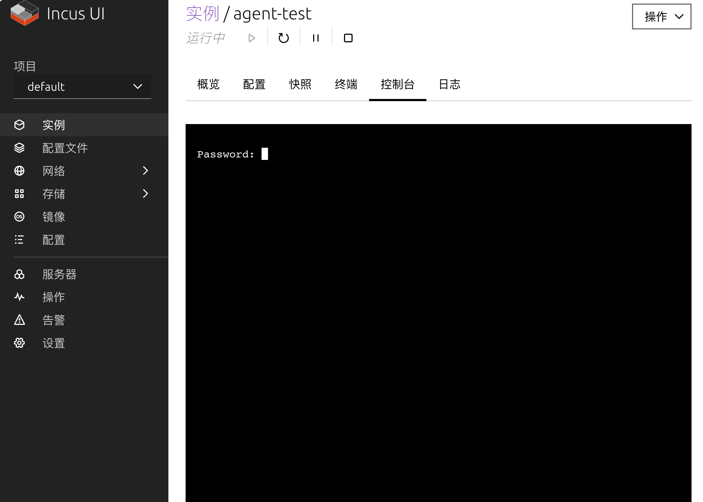
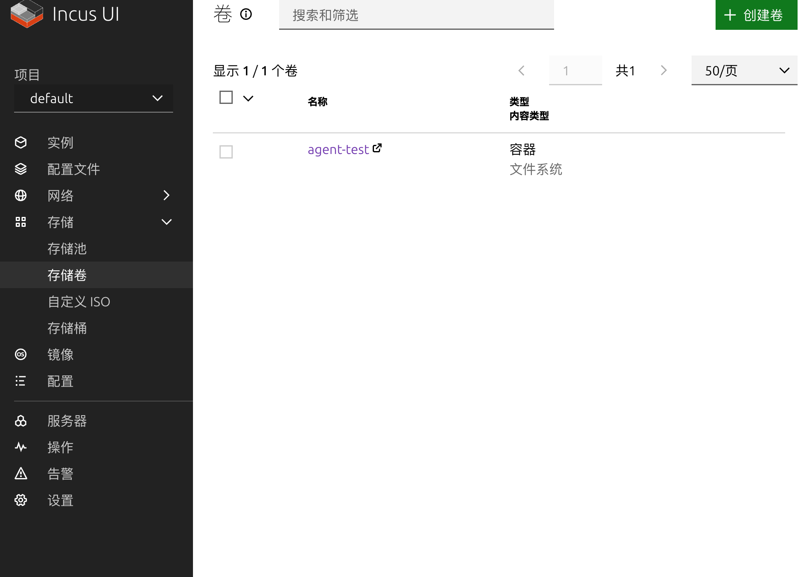
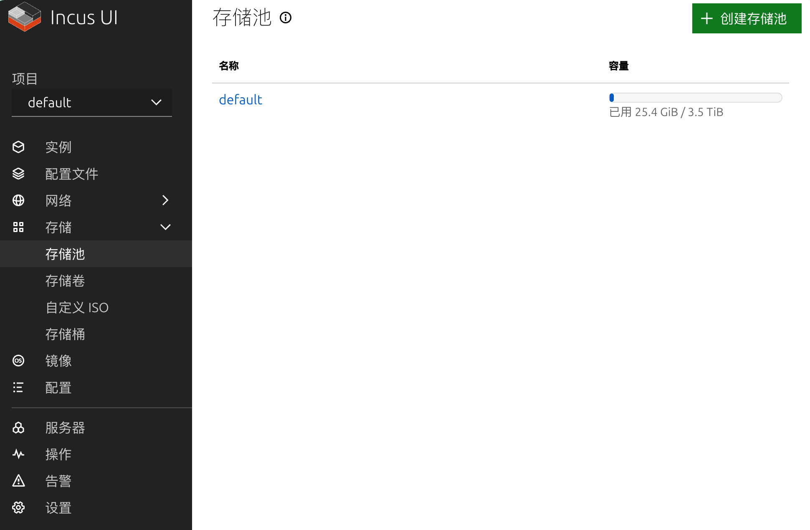
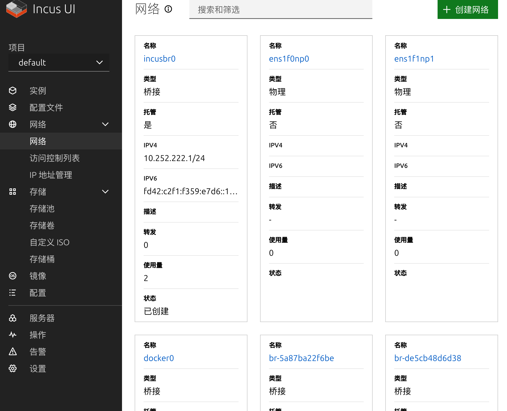
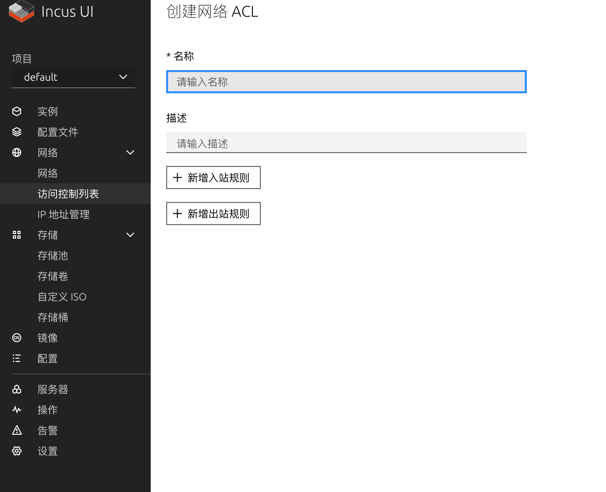
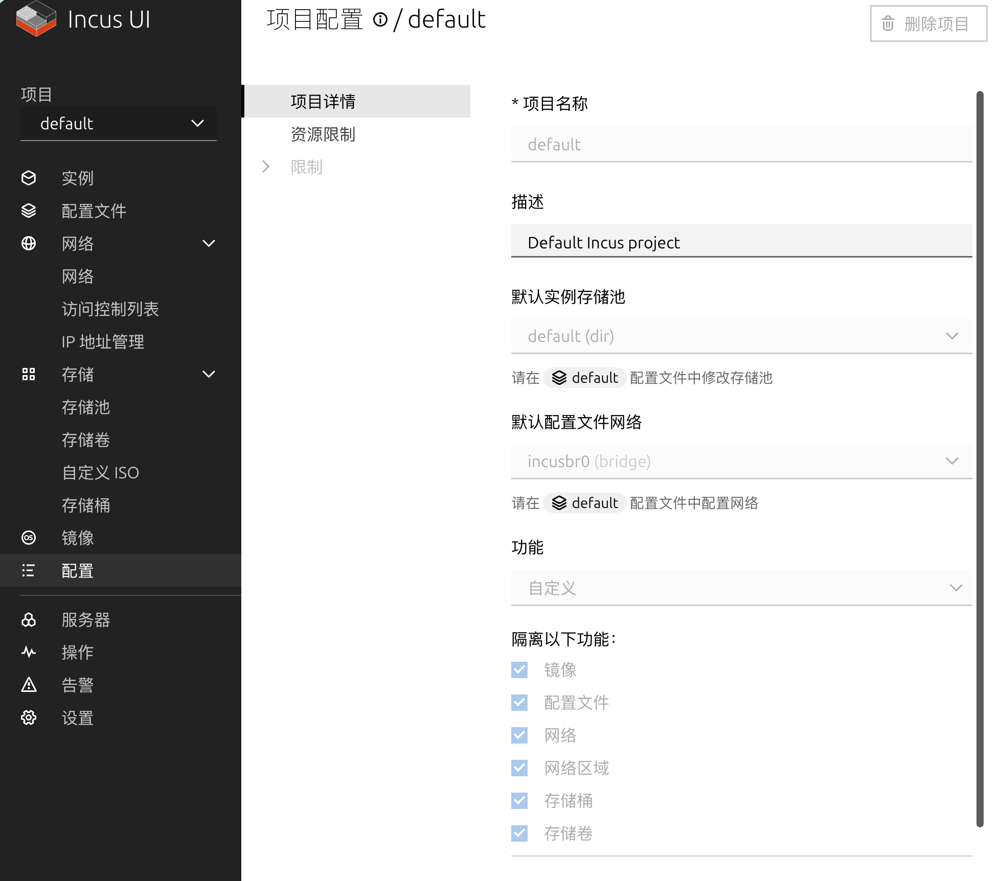
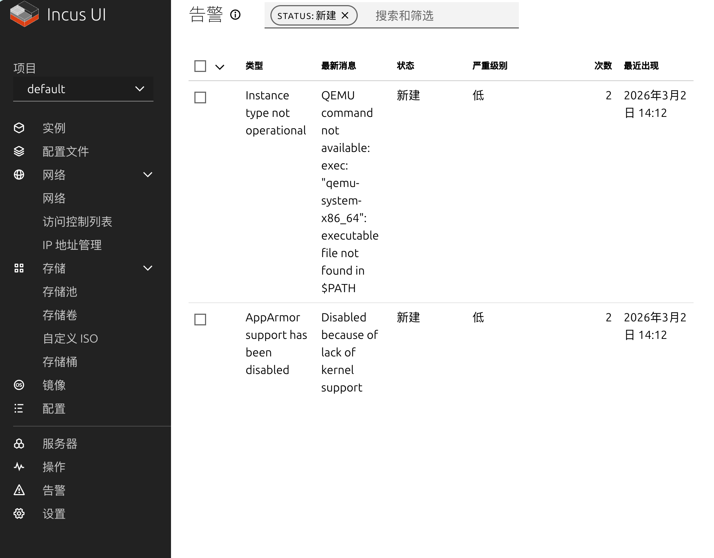

# Incus UI（中文）

Incus UI 是 Incus 的浏览器前端，用于更方便地管理容器和虚拟机，适用于小规模和大规模私有云场景。

**注意：此仓库（https://github.com/lfhy/incus-ui-cn）是原项目 https://github.com/zabbly/incus-ui-canonical 的汉化版本，旨在为中国用户提供中文界面和文档。**

## Incus Web UI 部署指南（nginx 反向代理）

本节提供一套可直接参考的部署方案：使用 nginx 提供 HTTPS + 基础认证，并由 nginx 使用客户端证书代理 Incus API。

### 功能特性

- Incus 6.0.0 容器和虚拟机管理
- 通过 nginx 提供 Web UI 面板
- 自签名证书 HTTPS 访问
- 基础认证（用户名/密码）
- nginx 处理到 Incus API 的客户端证书认证

### 访问信息（示例）

| 服务 | URL | 凭据 |
|------|-----|------|
| Web UI | https://192.168.4.167/ui/ | `admin / incus123` |
| API 直连 | https://192.168.4.167:8443/1.0 | TLS 证书 |

请将示例 IP `192.168.4.167` 替换为你自己的服务器地址。

### 快速开始

#### 1. 安装 Incus

```bash
# 从 Ubuntu 仓库安装 Incus
sudo apt update
sudo apt install -y incus incus-client

# AlmaLinux（先启用 EPEL/CRB，再安装）
sudo dnf install -y epel-release dnf-plugins-core
sudo dnf config-manager --set-enabled crb
sudo dnf install -y incus incus-client

# 初始化 Incus（最小配置）
sudo incus admin init --minimal

# 启用 HTTPS API
sudo incus config set core.https_address=:8443

# 将当前用户加入 incus 用户组
sudo usermod -aG incus-admin $USER
sudo usermod -aG incus $USER

# 启动并设置开机启动
sudo systemctl enable incus
sudo systemctl start incus
```

#### 2. 安装 Web UI

```bash
# 克隆并构建 Incus UI
cd /tmp
git clone https://github.com/zabbly/incus-ui-canonical.git
cd incus-ui-canonical
npm install --legacy-peer-deps
npm run build

# 复制构建产物到目标目录
sudo mkdir -p /opt/incus/ui
sudo cp -r build/ui/* /opt/incus/ui/
sudo chown -R root:incus-admin /opt/incus/ui
```

#### 3. 配置 nginx 认证与证书

```bash
# 安装 nginx 与密码工具
sudo apt install -y nginx apache2-utils

# AlmaLinux 对应安装方式
sudo dnf install -y nginx httpd-tools

# 创建基础认证账号（示例账号：admin / incus123）
sudo htpasswd -bc /etc/nginx/.htpasswd admin incus123

# 生成给 Incus API 使用的客户端证书
openssl req -x509 -newkey rsa:2048 \
    -keyout /tmp/incus-client.key \
    -out /tmp/incus-client.crt \
    -days 365 -nodes -subj "/CN=incus-ui"

# 将客户端证书加入 Incus 信任列表
sudo incus config trust add /tmp/incus-client.crt

# 将证书复制到 nginx 目录
sudo cp /tmp/incus-client.crt /etc/nginx/incus-client.crt
sudo cp /tmp/incus-client.key /etc/nginx/incus-client.key
sudo chown www-data:www-data /etc/nginx/incus-client.*

# 创建 nginx HTTPS 自签名证书
sudo mkdir -p /etc/nginx/ssl
sudo openssl req -x509 -nodes -days 365 -newkey rsa:2048 \
    -keyout /etc/nginx/ssl/nginx.key \
    -out /etc/nginx/ssl/nginx.crt \
    -subj "/CN=incus-ui"
```

#### 4. 配置 nginx 站点

```bash
# 复制 nginx 配置文件（请按你的实际路径调整）
sudo cp nginx/incus-ui.conf /etc/nginx/sites-available/incus-ui
sudo ln -sf /etc/nginx/sites-available/incus-ui /etc/nginx/sites-enabled/

# 移除默认站点
sudo rm -f /etc/nginx/sites-enabled/default

# 检查并重启 nginx
sudo nginx -t
sudo systemctl restart nginx
sudo systemctl enable nginx
```

### 常用 Incus 命令

```bash
# 列出实例
incus list

# 创建并启动容器
incus launch images:ubuntu/22.04 my-container

# 启动/停止容器
incus start my-container
incus stop my-container

# 进入容器执行命令
incus exec my-container -- bash

# 列出镜像
incus image list
```

### 日志查看

```bash
# Incus 日志
sudo tail -f /var/log/incus/incus.log

# nginx 日志
tail -f /var/log/nginx/access.log
tail -f /var/log/nginx/error.log
```

### 故障排查

```bash
# 查看服务状态
systemctl status incus
systemctl status nginx

# 查看监听端口
ss -tlnp | grep -E "nginx|8443"

# 测试 API 连接（本机）
curl -k https://127.0.0.1:8443/1.0

# 测试 API 连接（远程 + 客户端证书）
curl -k --cert /tmp/incus-client.crt --key /tmp/incus-client.key \
    https://192.168.4.167:8443/1.0

# 重启服务
sudo systemctl restart incus
sudo systemctl restart nginx
```

### 安全说明

- 默认账号密码为 `admin / incus123`，部署后请立即修改。
- 客户端证书会被 Incus 信任，可通过 `incus config trust list` 查看指纹。
- 示例使用自签名证书，浏览器会出现安全提示。
- 生产环境建议使用有效 CA 证书（如 Let's Encrypt）。

### 常见路径

| 项目 | 路径 |
|------|------|
| Incus 数据目录 | `/var/lib/incus/` |
| Web UI 文件目录 | `/opt/incus/ui/` |
| nginx 站点配置 | `/etc/nginx/sites-available/incus-ui` |
| nginx 密码文件 | `/etc/nginx/.htpasswd` |
| nginx SSL 证书目录 | `/etc/nginx/ssl/` |
| Incus 客户端证书 | `/etc/nginx/incus-client.crt` |
| Incus 客户端私钥 | `/etc/nginx/incus-client.key` |

## 贡献

你可能会用到：

- [贡献指南](CONTRIBUTING.md)：了解开发流程、构建和测试方法。
- 上游源码仓库：https://github.com/canonical/lxd-ui

## 架构

Incus UI 是一个基于 TypeScript + React 的单页应用。更多开发与打包说明见 [架构文档](ARCHITECTURE.MD)。

## 更新日志

版本变化请查看：https://github.com/canonical/lxd-ui/releases

## 路线图

未来计划与高优先级功能见 [路线图](ROADMAP.md)。

## 示例截图

| 创建实例 | 实例列表 |
|----------|----------|
|  |  |

| 实例终端 | 图形控制台 |
|----------|------------|
|  |  |

| 存储池 | 存储卷 |
|--------|--------|
|  |  |

| 网络 | 网络 ACL |
|------|----------|
|  |  |

| 配置文件 | 警告 |
|----------|------|
|  |  |
